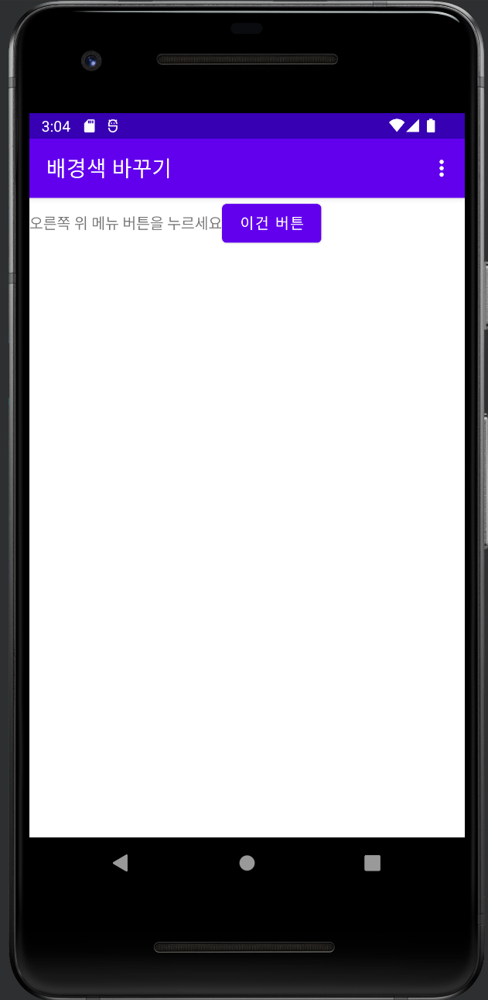

  
# 7-1 배경색 바꾸기 앱 만들기 

## 화면 디자인 구성 
   
* 바깥 리니어레이아웃 
    - 바깥 리니어레이아웃의 아이디를 baseLayout으로 한다.  
    - 텍스트뷰 1개와 버튼 1개를 생성한다. 버튼의 아이디는 button1로 한다.  
      
* 아이디 지정 
    - Java 코드에서 레이아웃과 버튼에 접근하기 위해 아이디를 지정한다.    

  
---
  
  
## 자바 코드 설정
    
1. activity_main.xml의 레이아웃과 버트에 대응할 전역 변수 2개를 선언한다. 
  
2. 메인 함수 onCreate( ) 안에서 위젯 변수 2개에 위젯을 대입한다. 
  
3. onCreateOptionsMenu()메소드를 선택하고 오버라이딩한다. 
- 메뉴 인플레이터를 생성하고 앞에서 작성한 menu.xml을 등록한다. 
  
4. onOptionsItemSelected()메소드를 오버라이딩한다. 
- switch case문을 사용하여 선택한 항목에 맞는 배경색을 설정한다. 
- setscale로 버튼을 확대하거나 setrotation으로 화면을 회전한다. 
  

---
  

## 실행 결과 
  

### 첫 화면 설정 (버튼과 상단 오른쪽 메뉴 버튼)
  

  

### 배경색 변경(빨강, 초록, 파랑)
  

  

### 버튼 확대, 회전
  

  