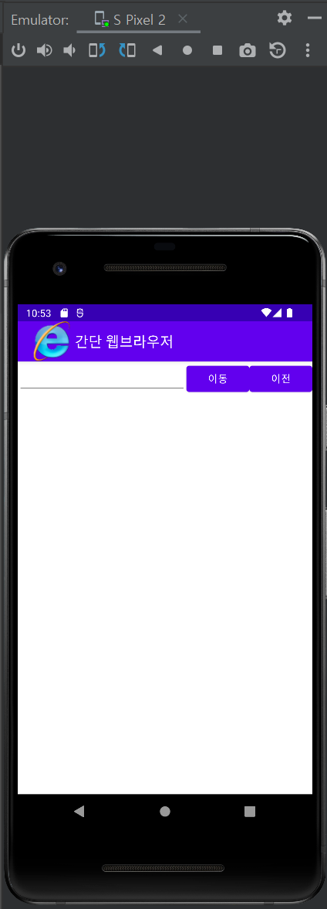
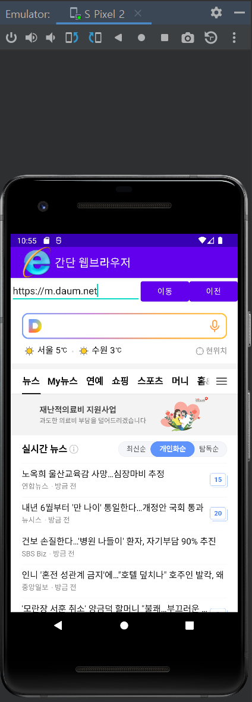

<br></br>

# 간단 웹브라우저 앱 만들기 

* 에디트텍스트에 URL 입력하여 해당 리크로 이동하는 앱을 만든다. 
* 화면 로고와 프로그램의 아이콘도 변경한다. 
<br></br>
---
<br></br>

## 화면 디자인 구성 
* 리니어 레이아웃을 하나 더 만들고 그 안에 에디트텍스트 1개와 버튼 2개를 구성한다. 
<br></br>    
* 하단에 웹뷰를 만든다. 
<br></br>    
* 각 위젯의 아이디는 edtUrl, btnGo, btnBack, webView1로 한다. 
<br></br>
---
<br></br>
  
## 자바 코드 설정 
<br></br>
1. 위젯에 대응하는 변수를 선언하고 4개의 변수에 위젯을 대입한다. 
<br></br>
2. WebViewClient의 상속을 받는 CookWebViewClient 클래스를 정의한다.  
<br></br>
3. WebSettings 클래스를 이용하여 줌 버튼 컨트롤이 화면에 보이게 하고, 웹뷰에서 자바스크립트가 작동되게 한다. 
<br></br>
4. 에디트 텍스트에 입력한 URL 웹페이지가 웹뷰에 나오게 한다. 
<br></br>
---
<br></br>
  
## Manifest.xml 구성  
<br></br>
* 주의할 점 : 해당 프로젝트는 인터넷 사용이 허가되어야 하므로 아래의 코드가 꼭 필요하다.  

```
 <uses-permission android:name="android.permission.INTERNET"/>
```

<br></br>
---
<br></br>

## 실행 결과 
<br></br>

### 첫 화면 설정
<br></br>

<br></br>

### 링크 연동 화면 
<br></br>

