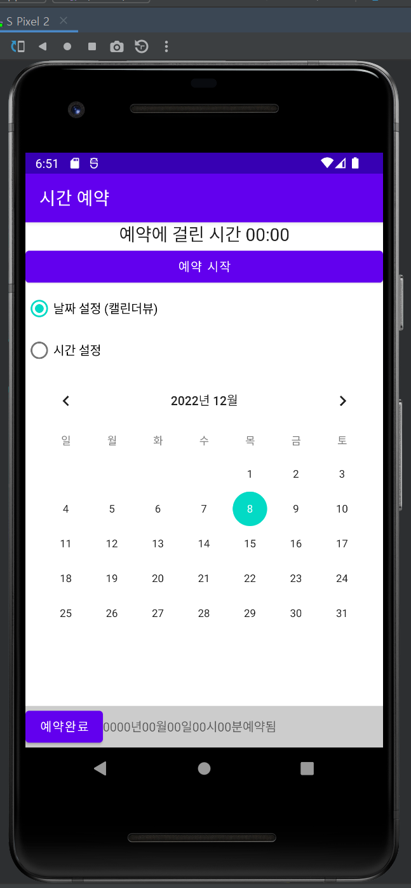

  
# 6-1 날짜/시간 예약 앱 만들기 
* 타이머 기능 : <예약 시작>과 <예약 완료>를 클릭하면 크로노미터가 타이머로 동작한다. 
* 날짜/시간 설정 : <날짜설정>과 <시간 설정>을 클릭하면 예약 날짜와 시간을 변경할 수 있다. 
* <예약완료>를 클릭하면 설정한 날짜와 시간이 결정된다. 
  
---
  

## 화면 디자인 구성 
* 리니어 레이아웃
    - 크로노미터 1개,  버튼 1개를 생성한다. 
    - 위젯의 아이디는 chronometer1, btnStart로 한다. 
      
* 라디오 그룹 
    - 라디오 버튼 2개를 생성한다.  
    - 위젯의 아이디는 rdoCal, rdoTime으로 한다. 
      
* 리니어 레이아웃  
    - 리니어레이아웃의 layout_weight를 1로 설정한다.   
    - 프레임레이아웃을 두고 안에 캘린더뷰 1개, 타임피커 1개를 생성한다. 
    - 위젯의 아이디는 calendarView1, timePicker1로 한다. 
      
* 리니어 레이아웃  
    - 버튼 1개, 텍스트뷰 10개를 생성한다.   
    - 버튼의 아이디는 btnEnd로, 텍스트뷰는 홀수 차례에만 아이디를 tvYear, tvMonth, tvDay, tvHour, tvMinute로 한다. 
  
---
  
  
## 자바 코드 설정 
1. 위젯 변수 12개를 대입하고, 첫 화면에서 캘린더뷰와 타임 피커가 보이지 않게 설정한다. (Invisibility)

2. 라디오버튼을 클릭시 캘린더뷰와 타임피커 중 하나씩만 보이도록 클릭 이벤트 리스너를 작성한다. 

3. <예약 시작>을 클릭하면 크로노미터가 시작되고 <예약완료>를 클릭하면 정지되도록 클릭 이벤트 리스너를 작성한다. 

4. 캘린더뷰에서 설정한 연, 월, 일이 타임피커에서 설정한 시, 분과 함께 맨 아래 텍스트 뷰에 채워진다. 
  
---
  

## 실행 결과 
  

### 첫 화면 설정 및 날짜 설정 버튼, 시간 설정 버튼 선택시 뜨는 화면
  

  

### 예약 시작 누른 후, 예약 완료 후 화면 
#### 예약에 걸린 시간이 상단에 뜨고 하단 텍스트 뷰에 예약된 시간이 입력된다. 
  

